# Project Roadmap: OpenFisca Aotearoa

This document details the long-term vision, requirements prioritization (MoSCoW), system architecture design, workspace subrepos, Hugging Face dataset resources, the NZ legislation codification pipeline, and release plan to bring OpenFisca Aotearoa to completion.

---

## 1. Vision & Architecture

The goal is to turn OpenFisca Aotearoa into a modern, type-safe, high-performance rules engine that models New Zealand legislation accurately and serves it via an optimized Web API.

### System Architecture Diagram

```mermaid
graph TD
    Client[Web & Third-Party Apps] -->|REST API Requests| API[Granian/Robyn Web Server]
    API -->|Validation & Parsing| Pydantic[Pydantic Models]
    Pydantic -->|Query Processing| Engine[OpenFisca Core Engine v44+]
    Engine -->|Parameters & Equations| Parameters[Legislation Parameters]
    Engine -->|Legislation Rules| Variables[Legislation Variables]
    Engine -->|Vector Calculations| Polars[Polars / NumPy 2.x / Faer]
    
    subgraph legal-nz-workspace Monorepo & Subrepos
        uv_work[UV Workspaces / Una Monorepo Manager]
        cli_leg[cli-legislation-nz / nz-legislation CLI]
        fyi_cli[fyi-cli / OIA Request Tool]
        nlp_policy[nlp-policy-nz / Policy NLP]
        open_social[open_social_data / Survey Datasets]
        sourceright[sourceright / Citation Workflows]
        gtpcnz[gtpcnz / Primary Care Funding Rules]
        voiage[voiage / Value of Information library]
        mars[mars / Spline Regression modeling]
        vop_poc[vop_poc_nz / Value of Perspective]
        innovate[innovate / Policy Diffusion Modeling]
    end
    
    subgraph Hugging Face edithatogo Datasets & Models
        hf_leg[nz-legislation-corpus & corpus-legislation-nz-historical]
        hf_hansard[nz-hansard-corpus]
        hf_llm[qwen3-4b-hermes-lora-peft-converted & strict-toolcall models / Safetensors]
    end
    
    hf_leg --> Engine
    cli_leg --> Engine
    open_social -->|Microsimulation Inputs| Engine
    hf_llm -->|AI Drafting/Parser Agents| Variables
    nlp_policy -->|Semantic Queries| Variables
    fyi_cli -->|Query OIA Interpretations| Variables
    sourceright -->|Document Citations| Variables
    gtpcnz -->|Primary Care Rules integration| Engine
    voiage -->|Decision analysis on simulation data| Engine
    mars -->|Predictive regression| Engine
    innovate -->|Policy Diffusion Modeling| Engine
```


---

## 2. Prioritized Requirements (MoSCoW)

### Must Have (Essential for Core Utility)
- Accurate translation of New Zealand tax, benefit, and family support rules.
- Fast, reproducible dependency environment via **`uv` Workspaces** and **`una`** monorepo tools inside `legal-nz-workspace`.
- Fast code linting and formatting via `ruff` utilizing the official `ruff-action` in CI.
- Complete multi-tier test suites (Unit, Integration, End-to-End, Smoke) with coverage >90%.
- Strict type safety validation of inputs using `pydantic v2` and `basedpyright` with all strict settings enabled.
- **OpenFisca Alignment:** Upgrade OpenFisca Core to v44+ to align with upstream standards.
- **Access Legislation:** Use the local subrepo `cli-legislation-nz` (`nz-legislation` CLI) to access legislative texts.

### Should Have (Important but Not Vital)
- High-performance web serving using a Rust-based runner like `granian` or `robyn`.
- Property-based testing using `hypothesis` to discover edge-cases in legislative rules.
- Prose validation of documentation and metadata using `vale`.
- Integration of `polars` and `Faer` (Rust linear algebra) for vector calculations.
- **Historical Tax Rules:** Integrate calculations and reference datasets from `nztaxmicrosim`.
- **Social Simulation Datasets:** Feed population-level microsimulations using datasets from `open_social_data`.
- **Wiki & Projects Integration:** Utilize GitHub Wiki and GitHub Projects for public milestones.
- **Academic Citation & Verification:** Use `sourceright` for generating citation metadata.
- **Astro on GitHub Pages:** Deploy an **Astro-based** static website to GitHub Pages to explore parameters and rule logic visually.

### Could Have (Nice to Have)
- Microsoft Power Platform Custom Connector setup.
- Mutation testing via **`pytest-gremlins`** for ultra-fast, coverage-guided mutation checks.
- AI-driven test script generation and automated execution using **`TestSprite`**.
- Cognitive complexity policing using `Complexipy` to ensure rule equations remain simple.
- **Semantic Mapping:** Integrate `nlp-policy-nz` to search parliamentary debates (`nz-hansard-corpus` / `corpus-nz-hansard`).
- **OIA Verifications:** Integrate `fyi-cli` to query official information act disclosures.
- **Primary Care Rules Integration:** Codify and integrate Aotearoa primary care funding rules based on the `gtpcnz` architecture.
- **Decisional Analytics & Profiling:** Use `voiage` (Value of Information) and `mars` (spline regression modeling).
- **Policy Diffusion Modeling:** Integrate `innovate` to simulate policy uptake.
- **Revolutionary Agent Automation:** Integrate fine-tuned legislative parser models from HuggingFace (loading weights securely via `Safetensors`).

### Won't Have (Deferred / Out of Scope)
- Direct frontend client built inside this repository (remains purely an API package).
- Direct compilation of Python to raw machine code.

---

## 3. NZ Legislation Codification Pipeline

To systematically translate physical New Zealand law into executable code, the project implements an automated **Legislation-to-Code Pipeline**:

```markdown
1. Fetch (nz-legislation CLI) -> 2. Logic Mapping (LLM / Safetensors) -> 3. Define Parameters -> 4. Code Variables -> 5. Situation/Unit Tests -> 6. Legal Audit & Publish
```

### Pipeline Description:
1. **Fetch via `nz-legislation` CLI:** Retrieve physical legislative texts (pulled from local `corpus-law-nz` and `nz-legislation-corpus`).
2. **Logic Mapping via LLM:** Use fine-tuned models from HuggingFace, search Hansard debates (`nz-hansard-corpus` / `corpus-nz-hansard`) via `nlp-policy-nz` for intent mapping, and query OIA documents via `fyi-cli` for clarify rules.
3. **Define Parameters:** Codify legislative rates, thresholds, and dates in the `openfisca_aotearoa/parameters/` YAML directories (referencing historical tax data from `nztaxmicrosim`).
4. **Code Variables:** Implement calculations and rules as Python classes in the `openfisca_aotearoa/variables/` directory (leveraging `ty` typing helpers). Use `sourceright` for generating exact citations.
5. **Situation & Unit Tests:** Write YAML/JSON test scenarios in `openfisca_aotearoa/tests/` matching known edge cases, using population cohorts from `open_social_data`. Audit cognitive complexity via `Complexipy`.
6. **Legal Audit & Publish:** Review code variable descriptions against the legal text for compliance before merging and deploying to the Web API.

---

## 4. Multi-Tier Testing Strategy
All testing is configured under strict settings (warnings as errors) to catch runtime defects:
- **Unit Tests:** Verify individual calculations and variable formulas.
- **Integration Tests:** Verify parameter structures and variable interactions.
- **End-to-End Tests:** Execute calculations through the Web API to verify API outputs.
- **Smoke Tests:** Perform lightweight validation of served endpoints to confirm service health.
- **AI-driven Tests:** Use `TestSprite` to automatically generate, run, and maintain test scenarios based on legislative requirements.
- **Fuzzing & Property-Based:** Run `hypothesis` checks to discover mathematical edge-cases.
- **Mutation Testing:** Run `pytest-gremlins` for ultra-fast, incremental mutation switching.
- **Performance Profiling:** Utilize `scalene` to profile memory usage and identify CPU bottlenecks.

---

## 5. Upstream & Reference Repositories Integration

To remain aligned with the official OpenFisca standards and past research, the following projects are integrated or referenced:

| Repository / Project | Integration Role / Purpose |
| --- | --- |
| [openfisca/country-template](https://github.com/openfisca/country-template) | Base template directory structure reference for building this country package. |
| [openfisca/openfisca-core](https://github.com/openfisca/openfisca-core) | Core computational engine dependency. |
| [edithatogo/legal-nz-workspace](https://github.com/edithatogo/legal-nz-workspace) | Parent workspace monorepo hosting this project and utility tools. |
| [edithatogo/nz-legislation](https://github.com/edithatogo/nz-legislation) | Official CLI tool for fetching legislation texts for codification. |
| [edithatogo/nztaxmicrosim](http://github.com/edithatogo/nztaxmicrosim) | Historical tax microsimulation model reference for validating historical tax brackets. |
| [edithatogo/open_social_data](https://github.com/edithatogo/open_social_data) | Population/demographic survey datasets for running simulation models. |
| [HuggingFace: edithatogo](https://huggingface.co/edithatogo) | Repository hosting fine-tuned LLMs and New Zealand legislative, historical, and Hansard datasets. |
| [edithatogo/sourceright](https://github.com/edithatogo/sourceright) | Citation workflow and reference management tool for variables. |
| [edithatogo/gtpcnz](https://github.com/edithatogo/gtpcnz) | Architecture for primary care funding logic modeling. |
| [edithatogo/voiage](https://github.com/edithatogo/voiage) | Value of Information calculation library for optimizing social policy data collections. |
| [edithatogo/mars](https://github.com/edithatogo/mars) | Multivariable spline regression tools for statistical calculations on datasets. |
| [edithatogo/innovate](https://github.com/edithatogo/innovate) | Policy diffusion modeling library to simulate post-reform uptake and spread. |
| [openfisca/openfisca-data-manager](https://github.com/openfisca/openfisca-data-manager) | Data cleaning and management library for microsimulation datasets. |
| [openfisca/openfisca-reform-simulator](https://github.com/openfisca/openfisca-reform-simulator) | Simulation framework used to test reforms to New Zealand tax and benefits rules. |
| [openfisca/legislation-explorer](https://github.com/openfisca/legislation-explorer) | Reference UI for visualizing rules and tracing them back to physical law. |

---

## 6. Implementation Tracks to Completion

```mermaid
gantt
    title Roadmap Schedule
    dateFormat  YYYY-MM-DD
    section Setup & Alignment
    Track 1: Modernize Tooling (UV Workspaces, Una, Ruff, Basedpyright, Complexipy) :active, 2026-06-15, 7d
    Track 2: Upstream Governance Alignment : 2026-06-22, 5d
    section Codification
    Track 3: Map Historical/Current Tax Rules (nztaxmicrosim) : 2026-06-27, 10d
    Track 4: Legislation Audit & Scaffolding : 2026-07-07, 7d
    section Automation & Deployment
    Track 5: GitHub CI/CD Automation & Multi-Tier Testing (Ruff Action, Hypothesis, Pytest-Gremlins, TestSprite) : 2026-07-14, 5d
    Track 6: Documentation Pages Explorer (Astro on GitHub Pages) : 2026-07-19, 5d
    Track 7: Release & Dependabot Lifecycle : 2026-07-24, 4d
    Track 8: Simulation Analytics & Policy Diffusion (Voiage, Mars, Innovate) : 2026-07-28, 8d
```

### Track 1: Modernize Tooling (Active)
Migrate project configuration to **UV Workspaces** and **Una** monorepo configurations, configure `ruff`, and set up `basedpyright` and `Complexipy` inside the [legal-nz-workspace](https://github.com/edithatogo/legal-nz-workspace) environment.

### Track 2: Upstream Governance Alignment
Document the fork status of `edithatogo/openfisca-aotearoa` as the primary active package, marking the legacy `BetterRules` and `digitalaotearoa` repositories as dormant archives in updated documentation.

### Track 3: Map Historical/Current Tax Rules
Import and map all existing historical tax rules and brackets from `nztaxmicrosim` into OpenFisca Aotearoa parameters, and update with newer NZ tax rules.

### Track 4: Legislation Audit & Scaffolding
Use the `nz-legislation` CLI tool to run a comprehensive audit of New Zealand legislation gaps, creating distinct Conductor tracks to explore and codify each target Act/Regulation as requested.

### Track 5: GitHub CI/CD Automation & Multi-Tier Testing
Scaffold GitHub Actions workflows utilizing the official `ruff-action`. Set up pytest checks across Unit, Integration, E2E, and Smoke tests. Set up strict warnings-as-errors configuration, and configure `hypothesis` fuzzing, `pytest-gremlins` mutation tests, `scalene` profiling, and `TestSprite` AI automation.

### Track 6: Documentation Pages Explorer
Deploy an **Astro-based** static documentation site and interactive parameter/variable explorer to GitHub Pages.

### Track 7: Release & Dependabot Lifecycle
Configure Dependabot to maintain bleeding-edge Rust tooling, and configure `hatch-vcs` for dynamic semantic tagging and auto-release builds.

### Track 8: Simulation Analytics & Policy Diffusion
Implement simulation analytics using `voiage` (Value of Information), `mars` regression, and `innovate` (policy diffusion and uptake modelling) over `open_social_data`.
